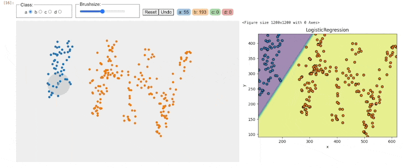

### drawdata 

> "Just draw some data and get on with your day."

This small Python library contains Jupyter widgets that allow you to draw a dataset in a Jupyter
notebook. This should be very useful when teaching machine learning algorithms.


The project uses [anywidget](https://anywidget.dev/) under the hood so our tools should work in Jupyter, VSCode and Colab. That also means that you get a proper widget that can interact with [ipywidgets](https://ipywidgets.readthedocs.io/en/stable/) natively. [Here](https://www.youtube.com/watch?v=STPv0jSAQEk) is an example where updating a drawing triggers a new scikit-learn model to train ([code](https://github.com/probabl-ai/youtube-appendix/blob/main/04-drawing-data/notebook.ipynb)).



You can really get creative with this in a notebook, so feel free to give it a spin!

#### Installation 

Installation occurs via pip. 

```
python -m pip install drawdata
```

To read the data, `polars` is useful, but this library also suppots `pandas`:

```
python -m pip install pandas polars
```

#### Usage: `ScatterWidget`

You can load the scatter widget to start drawing immediately. 

```python
from drawdata import ScatterWidget

widget = ScatterWidget()
widget
```

If you want to use the dataset that you've just drawn you can do so via: 

```python
# Get the drawn data as a list of dictionaries
widget.data

# Get the drawn data as a dataframe
widget.data_as_pandas
widget.data_as_polars
```

If you're eager to do scikit-learn stuff with your drawn data you may appreciate this property instead:

```
X, y = widget.data_as_X_y
```

The assumption for this property is that if you've used multiple colors that you're interested in doing classification and if you've only drawn one color you're interested in regression. In the case of regression `y` will refer to the y-axis.

#### Usage: `BarWidget`

```python 
from drawdata import BarWidget

widget = BarWidget(collection_names=["usage", "sunshine"], n_bins=24)
widget
```


