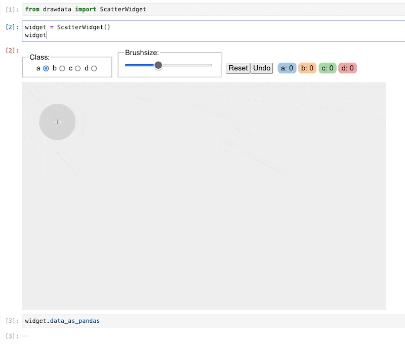
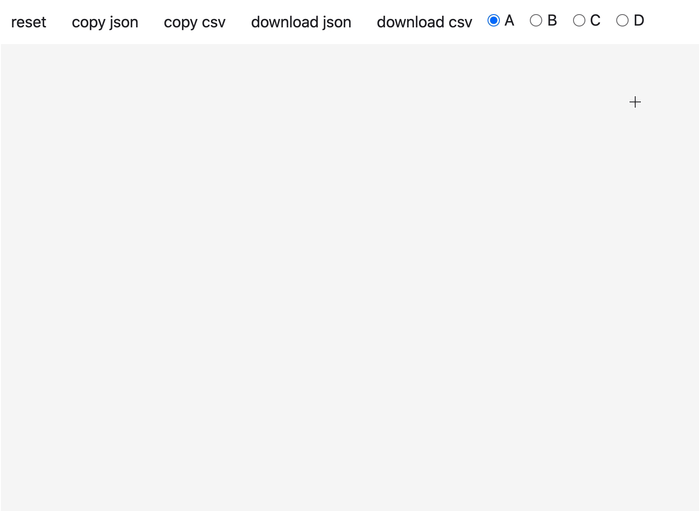

# drawdata 

This small Python library contains Jupyter widgets that allow you to draw a dataset in a Jupyter
notebook. This should be very useful when teaching machine learning algorithms.



The project uses [anywidget](https://anywidget.dev/) under the hood so our tools should work in Jupyter, VSCode and Colab. That also means that you get a proper widget that can interact with [ipywidgets](https://ipywidgets.readthedocs.io/en/stable/) natively. Here's an example where updating a drawing triggers a new scikit-learn model to train ([code](https://github.com/probabl-ai/youtube-appendix/blob/main/04-drawing-data/notebook.ipynb)).


## Installation 

Installation occurs via pip. 

```
python -m pip install drawdata
```

To read the data, `polars` is useful, but this library also suppots `pandas`:

```
python -m pip install pandas polars
```

## Usage

You can load the scatter widget to start drawing immediately. 

```python
from drawdata import ScatterWidget

widget = ScatterWidget()
widget
```

If you want to use the dataset that you've just drawn you can do so via: 

```python
# Get the drawn data as a list of dictionaries
widget.data

# Get the drawn data as a dataframe
widget.data_as_pandas
widget.data_as_polars
```

## Shoutout 

This project was originally part of my work over at [calmcode labs](https://calmcode.io/labs/drawdata) but my employer [probabl](https://probabl.ai) has
been very supportive and has allowed me to work on this project during
my working hours. This was super cool and I wanted to make sure I recognise them for it.

<p align="center" width="100%" dir="auto">
    
    
    <br><br><br>
</p>

<br>

## Old Features 

The original implementation of our widget would use an iframe to load a site in order
to be able to draw from a Jupyter notebook. This works, but requires more manual effort, only works with `pandas` via the clipboard feature and needs an internet connection. Here's what that widget looks like:



It will be kept around, but the way forward for this library is to build on top of anywidget.

### Old Feature Usage 

When you run this from jupyter, you should load in an iframe.

```python
from drawdata import draw_scatter

draw_scatter()
```

Once you're done drawing you can copy the data to the clipboard. After this you can use pandas to read the clipboard to get your drawn data into a dataframe.

```python
import pandas as pd 
pd.read_clipboard(sep=",")
```
