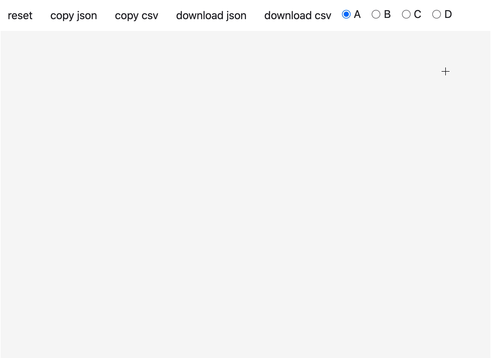

# drawdata 

This small python app allows you to draw a dataset in a jupyter
notebook. This should be very useful when teaching machine learning algorithms.



You can get the same tooling from going to [calmcode labs](https://calmcode.io/labs/drawdata.html)
but with this library you'll also be able to use it from within jupyter. This will save you a precious tab in the browser.

## Installation 

Installation occurs via pip. 

```
python -m pip install drawdata
```

To read the data, `pandas` is useful:

```
python -m pip install pandas
```

## Usage 

When you run this from jupyter, you should load in an iframe.

```python
from drawdata import draw_scatter

draw_scatter()
```

Once you're done drawing you can copy the data to the clipboard. After this you can use pandas to read the clipboard to get your drawn data into a dataframe.

```python
import pandas as pd 
pd.read_clipboard(sep=",")
```
